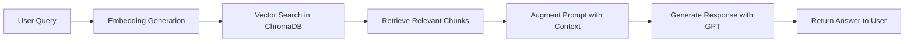

# Q&A ChatBot with RAG Pipeline

A Flask-based Question & Answer ChatBot that implements a complete **Retrieval-Augmented Generation (RAG)** pipeline using OpenAI embeddings and ChromaDB for vector storage.

## � Project Overview

This intelligent chatbot system crawls website content, processes it into searchable chunks, stores vector embeddings in ChromaDB, and provides accurate answers to user questions based on the retrieved context. The system uses a three-stage RAG pipeline:

1. **🔍 Retrieval**: Finds relevant content from the vector database based on semantic similarity
2. **📝 Augmentation**: Combines user questions with retrieved context to create enhanced prompts
3. **🤖 Generation**: Uses OpenAI's GPT model to generate contextually accurate responses

### Key Components:
- **Web Crawler**: Extracts clean content from websites recursively
- **Text Processing**: Chunks content using LangChain's RecursiveCharacterTextSplitter
- **Vector Database**: ChromaDB for persistent storage and fast similarity search
- **AI Pipeline**: OpenAI embeddings + GPT-4o-mini for intelligent responses
- **REST API**: Flask-based endpoints for easy integration

## �🚀 Features

- **Web Crawling**: Automated content extraction from websites
- **RAG Pipeline**: Complete Retrieval-Augmented Generation implementation
- **Vector Storage**: ChromaDB for efficient similarity search
- **Flask API**: RESTful API for chatbot interactions
- **Semantic Search**: Context-aware question answering

## 🏗️ Project Structure

```
Q&AChatBot/
├── main.py                     # Flask API server
├── requirements.txt            # Project dependencies
├── .env                        # Environment variables (API keys)
├── bot/
│   ├── __init__.py            # Bot package initialization
│   └── chat.py                # Main chat logic with RAG
├── crawling/
│   ├── __init__.py            # Crawling package
│   └── crawl.py               # Website content extraction
├── embeddings/
│   ├── __init__.py            # Embeddings package
│   └── generate_embeddings.py # Text chunking & embedding generation
├── chroma/
│   ├── __init__.py            # ChromaDB package
│   └── storage.py             # Vector storage & retrieval
├── chroma_db/                 # ChromaDB database files
└── scraped_content/           # Crawled website content
```

## 🔄 RAG Pipeline Implementation

### 1. **Retrieval (R) - Information Extraction & Storage**

#### Web Crawling (`crawling/crawl.py`)
```python
def crawl_website(url, output_dir='scraped_content'):
    # Extracts and cleans website content
    # Removes scripts, styles, and formatting
    # Saves clean text for processing
```

#### Text Chunking (`embeddings/generate_embeddings.py`)
```python
def create_chunks(file_path, chunk_size=1000, chunk_overlap=200):
    # Uses RecursiveCharacterTextSplitter from LangChain
    # Splits content into manageable chunks with overlap
    # Maintains context continuity between chunks
```

#### Embedding Generation
```python
def create_embeddings(chunks):
    # Converts text chunks to vector embeddings
    # Uses OpenAI's text-embedding-3-small model
    # Creates 1536-dimensional vectors for each chunk
```

#### Vector Storage (`chroma/storage.py`)
```python
def save_context(embeddings, chunks, content_path):
    # Stores embeddings in ChromaDB with metadata
    # Maintains source tracking and chunk indexing
    # Enables efficient similarity search
```

### 2. **Augmentation (A) - Semantic Search**

#### Query Processing
```python
def semantic_search(user_prompt, collection_name="documents", n_results=3):
    # Converts user query to embedding vector
    # Performs similarity search in ChromaDB
    # Returns most relevant content chunks
```

#### Context Retrieval
```python
def query_context(query_embedding, collection_name="documents", n_results=3):
    # Searches vector database for similar content
    # Ranks results by similarity score
    # Returns relevant chunks with metadata
```

### 3. **Generation (G) - AI Response Creation**

#### Response Generation (`bot/chat.py`)
```python
def user_query(prompt):
    # Retrieves relevant context using semantic search
    # Augments user prompt with retrieved information
    # Generates contextual response using OpenAI GPT
```

## 🛠️ Technical Stack

- **Framework**: Flask (Python web framework)
- **Vector Database**: ChromaDB (persistent vector storage)
- **Embeddings**: OpenAI text-embedding-3-small
- **LLM**: OpenAI GPT-4o-mini
- **Text Processing**: LangChain RecursiveCharacterTextSplitter
- **Web Scraping**: BeautifulSoup4

## 📋 Prerequisites

- Python 3.8+
- OpenAI API key
- Required packages (see `requirements.txt`)

## ⚡ Quick Start

### 1. Clone and Setup
```bash
git clone https://github.com/faisal1025/Q-AChatBotAirtribe.git
cd Q&AChatBot
python -m venv env
env\Scripts\activate  # Windows
pip install -r requirements.txt
```

### 2. Environment Configuration
Create `.env` file:
```
OPENAI_API_KEY=your_openai_api_key_here
```

### 3. Initialize Knowledge Base
```python
python bot/__init__.py  # Auto-crawls and processes content
```

### 4. Start the API Server
```bash
python main.py
```

## 🕷️ Steps to Run the Crawler

### Method 1: Using the API Endpoint (Recommended)

1. **Start the Flask server:**
   ```bash
   python main.py
   # OR
   flask --app main run
   ```

2. **Make a POST request to `/crawl`:**
   ```powershell
   # Using PowerShell
   Invoke-RestMethod -Uri "http://127.0.0.1:5000/crawl" -Method POST -Headers @{"Content-Type"="application/json"} -Body '{"url": "https://qualityesnad.com.sa/"}'
   ```

   ```bash
   # Using curl
   curl -X POST -H "Content-Type: application/json" -d '{"url": "https://qualityesnad.com.sa/"}' http://127.0.0.1:5000/crawl
   ```

3. **Monitor the process:**
   - The crawler will extract content from the website and internal links
   - Text will be chunked using RecursiveCharacterTextSplitter  
   - Embeddings will be generated using OpenAI's text-embedding-3-small
   - Vector data will be stored in ChromaDB for fast retrieval

### Method 2: Direct Python Script

1. **Create a crawl script:**
   ```python
   from crawling.crawl import crawl_website
   from embeddings.generate_embeddings import create_chunks, create_embeddings
   from chroma.storage import save_context
   
   # Crawl website
   url = "https://qualityesnad.com.sa/"
   saved_files = crawl_website(url, depth=2)
   
   # Process all files
   all_embeddings = []
   all_chunks = []
   all_metadata = []
   
   for file_path in saved_files:
       chunks = create_chunks(file_path)
       embeddings = create_embeddings(chunks)
       metadata = [{"filename": file_path, "chunk_index": i} for i in range(len(chunks))]
       
       all_embeddings.extend(embeddings)
       all_chunks.extend(chunks)
       all_metadata.extend(metadata)
   
   # Save to ChromaDB
   save_context(all_embeddings, all_chunks, all_metadata)
   print("✅ Crawling and embedding completed!")
   ```

2. **Run the script:**
   ```bash
   python your_crawl_script.py
   ```

### Crawler Configuration Options:

- **`depth`**: How many levels deep to crawl (default: 2)
- **`delay`**: Seconds between requests (default: 1)
- **`max_links`**: Maximum links to process per page
- **`output_dir`**: Directory to save scraped content

```python
# Example with custom settings
crawl_website(
    url="https://example.com",
    depth=3,        # Crawl 3 levels deep
    delay=2,        # 2 second delay between requests
    output_dir="my_content"
)
```

## 🧪 How to Test the `/ask` Endpoint

### 1. Start the Server
```bash
python main.py
```
*You should see: "Running on http://127.0.0.1:5000"*

### 2. Test Methods

#### Method A: Using PowerShell (Windows)
```powershell
# Basic test
Invoke-RestMethod -Uri "http://127.0.0.1:5000/ask" -Method POST -Headers @{"Content-Type"="application/json"} -Body '{"prompt": "What services do you offer?"}'

# Test with different questions
Invoke-RestMethod -Uri "http://127.0.0.1:5000/ask" -Method POST -Headers @{"Content-Type"="application/json"} -Body '{"prompt": "Do you provide ISO certification?"}'
```

#### Method B: Using Python Requests
```python
import requests
import json

def test_chatbot(question):
    url = "http://127.0.0.1:5000/ask"
    payload = {"prompt": question}
    
    try:
        response = requests.post(url, json=payload)
        result = response.json()
        
        print(f"Question: {question}")
        print(f"Status: {response.status_code}")
        print(f"Answer: {result.get('response', 'No response')}")
        print(f"Sources: {result.get('source', 'No sources')}")
        print("-" * 60)
        
    except Exception as e:
        print(f"Error: {e}")

# Test multiple questions
test_questions = [
    "What services does Quality Esnad provide?",
    "Do you offer ISO certification?",
    "What are your contact details?",
    "Tell me about your company"
]

for question in test_questions:
    test_chatbot(question)
```

#### Method C: Using cURL
```bash
# Linux/Mac or Windows with curl installed
curl -X POST http://127.0.0.1:5000/ask \
  -H "Content-Type: application/json" \
  -d '{"prompt": "What services do you provide?"}'
```

### 3. Expected Response Format
```json
{
  "response": "Yes, we do provide ISO 9001 Certification. Our certification program includes training and audits to help ensure your business meets international quality management standards. With our expertise, we can assist you in implementing the necessary processes to achieve compliance, enhance your operational efficiency, and boost customer satisfaction. If you're interested, please let us know, and we can provide you with more details or a quote.",
  "source": "https://qualityesnad.com.sa/product/iso-9001-certification-quality-management-system/\n\nhttps://qualityesnad.com.sa/\n\nhttps://qualityesnad.com.sa/"
}
```

### 4. Response Structure
The chatbot returns responses with:
- **response**: Direct answer to the user's question with professional, helpful content
- **source**: Newline-separated URLs of relevant website pages where information was found
- **Context-aware**: Answers based on crawled content from Quality Esnad website

## 🔌 API Usage

### API Endpoints

#### `GET /`
- **Description**: Welcome message
- **Response**: Simple greeting

#### `POST /crawl`
- **Description**: Crawl a website and store embeddings
- **Request Body**: 
  ```json
  {
    "url": "https://example.com"
  }
  ```
- **Response**:
  ```json
  {
    "message": "Crawling and embedding completed successfully"
  }
  ```

#### `POST /ask`
- **Description**: Process user query through RAG pipeline
- **Request Body**: 
  ```json
  {
    "prompt": "Your question here"
  }
  ```
- **Response**:
  ```json
  {
    "response": "AI-generated answer based on retrieved context",
    "source": "https://source1.com\n\nhttps://source2.com"
  }
  ```

## 💬 Example Questions and Answers

### Quality & Certification Related

**Q: "Do you provide ISO 9001 certification?"**
> A: Yes, we do provide ISO 9001 Certification. Our certification program focuses on quality management standards that enhance operational efficiency, customer satisfaction, and overall business reputation. We offer training and auditing services to ensure that your business meets international standards effectively. If you're interested in getting certified or would like more information, please let us know how we can assist you further!
> 
> **Sources:**
> - https://qualityesnad.com.sa/product/iso-9001-certification-quality-management-system/
> - https://qualityesnad.com.sa/

**Q: "What ISO certifications does Quality Esnad provide?"**
> A: Quality Esnad provides a comprehensive range of ISO certifications including:
> - ISO 9001 (Quality Management System)
> - ISO 14001 (Environmental Management System) 
> - ISO 45001 (Occupational Health and Safety)
> - ISO 27001 (Information Security Management)
> - ISO 22000 (Food Safety Management)
> - ISO 13485 (Medical Device Quality Management)
> And many other specialized certifications tailored to different industries.
> 
> **Sources:** Multiple certification pages on qualityesnad.com.sa

**Q: "How can I get HACCP certification?"**
> A: Quality Esnad offers HACCP (Hazard Analysis Critical Control Point) certification services. Our process includes gap analysis, documentation development, implementation support, internal audits, and final certification audit. Contact us for a customized approach based on your food industry requirements.
> 
> **Sources:** Quality Esnad certification services pages

### Company Information

**Q: "Tell me about Quality Esnad company"**
> A: Quality Esnad is a leading certification and consulting company in Saudi Arabia specializing in management system certifications. We provide expert consulting, training, and certification services to help organizations achieve compliance with international standards and improve their operational excellence.
> 
> **Sources:**
> - https://qualityesnad.com.sa/about-iso-certification-company/
> - https://qualityesnad.com.sa/

**Q: "What industries do you serve?"**
> A: We serve multiple industries including:
> - Food and Beverage
> - Oil and Gas
> - Healthcare and Medical Devices
> - Manufacturing
> - Electrical and Electronics
> - Construction
> - Information Technology
> And many other sectors requiring quality and compliance certifications.
> 
> **Sources:** Industry-specific certification pages on Quality Esnad website

### Services & Support

**Q: "Do you provide training services?"**
> A: Yes, Quality Esnad offers comprehensive training programs including:
> - Lead Auditor training courses
> - Internal Auditor training
> - Awareness sessions for management systems
> - Industry-specific compliance training
> - Customized training programs for organizations
> 
> **Sources:** Training and consulting service pages

**Q: "How long does the certification process take?"**
> A: The certification timeline varies based on organization size, complexity, and readiness. Typically:
> - Gap analysis: 1-2 weeks
> - Documentation development: 2-6 weeks  
> - Implementation: 1-3 months
> - Certification audit: 1-2 weeks
> Our team provides detailed project timelines during initial consultation.
> 
> **Sources:** Certification process and consulting pages

### Contact & Support

**Q: "How can I contact Quality Esnad?"**
> A: You can reach Quality Esnad through:
> - Website: https://qualityesnad.com.sa
> - Email: Contact information available on website
> - Phone: Details provided on contact page
> We're available to discuss your certification needs and provide customized solutions.
> 
> **Sources:**
> - https://qualityesnad.com.sa/contact-us/
> - https://qualityesnad.com.sa/

### Response Features
- **Contextual Answers**: Based on actual crawled website content
- **Source Attribution**: Direct links to relevant pages for verification
- **Professional Tone**: Customer service-oriented responses
- **Accurate Information**: Retrieved from Quality Esnad's official website

## ⚠️ Limitations and Future Improvements

### Current Limitations

#### 🔍 **Content Scope**
- **Limited to crawled content**: Responses are only as good as the website content that has been crawled
- **Static knowledge**: No real-time updates unless content is re-crawled
- **Single source**: Currently designed for one primary website (Quality Esnad)

#### 🤖 **AI & Processing**
- **Context window limits**: Large documents may exceed token limits
- **Embedding quality**: Depends on OpenAI's embedding model performance
- **Response accuracy**: AI may occasionally generate inaccurate information
- **Language support**: Primarily optimized for English content

#### 🔧 **Technical Constraints**
- **ChromaDB storage**: Local storage limits scalability
- **Crawling depth**: Limited depth to prevent infinite crawling
- **Rate limiting**: Basic rate limiting may not handle high traffic
- **Error handling**: Limited graceful degradation for failed components

#### 📊 **Performance & Scale**
- **Single-threaded processing**: No parallel processing for large crawls
- **Memory usage**: Large embeddings consume significant memory
- **Response time**: Semantic search can be slow with large datasets
- **Concurrent users**: Not optimized for multiple simultaneous users

### 🚀 Future Improvements

#### 📈 **Enhanced Functionality**
- [ ] **Multi-website support**: Crawl and index multiple websites simultaneously
- [ ] **Real-time updates**: Implement scheduled re-crawling and incremental updates
- [ ] **Document upload**: Allow users to upload PDF, Word, and other document formats
- [ ] **Conversation memory**: Maintain context across multiple questions in a session
- [ ] **Advanced filtering**: Filter responses by date, source, or content type

#### 🌐 **Scalability & Performance**
- [ ] **Database optimization**: Migrate to production-grade vector database (Pinecone, Weaviate)
- [ ] **Caching system**: Implement Redis for frequently asked questions
- [ ] **Async processing**: Add background task processing for crawling and embedding
- [ ] **Load balancing**: Support for multiple server instances
- [ ] **CDN integration**: Faster content delivery for global users

#### 🔒 **Security & Reliability**
- [ ] **API authentication**: Implement JWT or API key authentication
- [ ] **Rate limiting**: Advanced rate limiting and DDoS protection  
- [ ] **Data validation**: Enhanced input sanitization and validation
- [ ] **Backup systems**: Automated database backups and recovery
- [ ] **Monitoring**: Real-time system health and performance monitoring

#### 🎯 **User Experience**
- [ ] **Web interface**: Create a user-friendly web dashboard
- [ ] **Response formatting**: Better formatting with markdown, links, and images
- [ ] **Multilingual support**: Support for Arabic and other languages
- [ ] **Source citations**: Show exact sources and page references
- [ ] **Feedback system**: User rating and feedback collection

#### 🧠 **AI Improvements**
- [ ] **Fine-tuned models**: Custom-trained models for domain-specific responses
- [ ] **Hybrid search**: Combine semantic and keyword-based search
- [ ] **Answer validation**: Cross-reference answers with multiple sources
- [ ] **Confidence scoring**: Provide confidence levels for responses
- [ ] **Dynamic prompting**: Adaptive prompts based on query type

#### 📊 **Analytics & Insights**
- [ ] **Usage analytics**: Track popular questions and response quality
- [ ] **Content gaps**: Identify frequently asked questions with poor answers
- [ ] **Performance metrics**: Response time, accuracy, and user satisfaction tracking
- [ ] **A/B testing**: Test different AI models and prompt strategies
- [ ] **Dashboard reporting**: Admin dashboard for system insights

#### 🔧 **Development & Deployment**
- [ ] **Docker containers**: Containerized deployment for easy scaling
- [ ] **CI/CD pipeline**: Automated testing and deployment
- [ ] **API versioning**: Proper API version management
- [ ] **Documentation**: Interactive API documentation with Swagger
- [ ] **Testing suite**: Comprehensive unit and integration tests

### 📋 Contributing Roadmap

If you'd like to contribute to these improvements:

1. **Pick an improvement** from the list above
2. **Create an issue** describing your proposed solution
3. **Fork the repository** and create a feature branch
4. **Implement the feature** with appropriate tests
5. **Submit a pull request** with clear documentation

### 💡 Priority Improvements

For the next release, we recommend focusing on:
1. **Web interface** for better user experience
2. **Multi-website support** for broader knowledge base
3. **Performance optimization** for faster responses
4. **API authentication** for production deployment

---

*Last updated: December 2025*

## 🧠 RAG Pipeline Flow



## 📊 How It Works

1. **Content Ingestion**: 
   - Crawls website content
   - Chunks text into manageable pieces
   - Generates embeddings for each chunk
   - Stores vectors in ChromaDB with metadata

2. **Query Processing**:
   - User submits question via API
   - System converts question to embedding
   - Performs similarity search in vector database
   - Retrieves most relevant content chunks

3. **Response Generation**:
   - Augments user query with retrieved context
   - Sends enhanced prompt to OpenAI GPT
   - Returns contextually accurate response

## 🔧 Configuration

### Embedding Settings
- **Model**: `text-embedding-3-small`
- **Dimensions**: 1536
- **Chunk Size**: 1000 characters
- **Chunk Overlap**: 200 characters

### Vector Database
- **Database**: ChromaDB (persistent)
- **Collection**: "documents"
- **Search Results**: Top 3-5 relevant chunks

### LLM Configuration
- **Model**: `gpt-4o-mini`
- **Temperature**: Default (configurable)
- **Max Tokens**: Default (configurable)

## 📝 Example Workflow

```python
# 1. Initialize (runs automatically on import)
from bot import chat

# 2. Process content (if not already done)
url = "https://example.com"
file_path = crawl_website(url)
chunks = create_chunks(file_path)
embeddings = create_embeddings(chunks)
save_context(embeddings, chunks, file_path)

# 3. Query the system
response = user_query("What services do you provide?")
print(response)
```

## 🎯 Key Benefits

- **Accurate Responses**: Answers based on actual website content
- **Scalable**: Can handle multiple websites and large content volumes
- **Fast Retrieval**: Vector similarity search for quick relevant content finding
- **Context Aware**: Maintains conversation context through RAG pipeline
- **API Ready**: RESTful interface for easy integration

## 🚀 Future Enhancements

- [ ] Multi-document support
- [ ] Conversation history
- [ ] Advanced filtering and search
- [ ] Real-time content updates
- [ ] Performance monitoring
- [ ] Batch processing capabilities

## 🤝 Contributing

1. Fork the repository
2. Create a feature branch
3. Make your changes
4. Test thoroughly
5. Submit a pull request

---

**Built with ❤️ using RAG architecture for intelligent question answering**