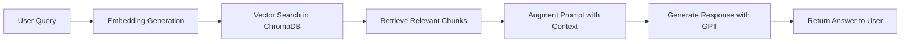

# Q&A ChatBot with RAG Pipeline

A Flask-based Question & Answer ChatBot that implements a complete **Retrieval-Augmented Generation (RAG)** pipeline using OpenAI embeddings and ChromaDB for vector storage.

## 🚀 Features

- **Web Crawling**: Automated content extraction from websites
- **RAG Pipeline**: Complete Retrieval-Augmented Generation implementation
- **Vector Storage**: ChromaDB for efficient similarity search
- **Flask API**: RESTful API for chatbot interactions
- **Semantic Search**: Context-aware question answering

## 🏗️ Project Structure

```
Q&AChatBot/
├── main.py                     # Flask API server
├── requirements.txt            # Project dependencies
├── .env                        # Environment variables (API keys)
├── bot/
│   ├── __init__.py            # Bot package initialization
│   └── chat.py                # Main chat logic with RAG
├── crawling/
│   ├── __init__.py            # Crawling package
│   └── crawl.py               # Website content extraction
├── embeddings/
│   ├── __init__.py            # Embeddings package
│   └── generate_embeddings.py # Text chunking & embedding generation
├── chroma/
│   ├── __init__.py            # ChromaDB package
│   └── storage.py             # Vector storage & retrieval
├── chroma_db/                 # ChromaDB database files
└── scraped_content/           # Crawled website content
```

## 🔄 RAG Pipeline Implementation

### 1. **Retrieval (R) - Information Extraction & Storage**

#### Web Crawling (`crawling/crawl.py`)
```python
def crawl_website(url, output_dir='scraped_content'):
    # Extracts and cleans website content
    # Removes scripts, styles, and formatting
    # Saves clean text for processing
```

#### Text Chunking (`embeddings/generate_embeddings.py`)
```python
def create_chunks(file_path, chunk_size=1000, chunk_overlap=200):
    # Uses RecursiveCharacterTextSplitter from LangChain
    # Splits content into manageable chunks with overlap
    # Maintains context continuity between chunks
```

#### Embedding Generation
```python
def create_embeddings(chunks):
    # Converts text chunks to vector embeddings
    # Uses OpenAI's text-embedding-3-small model
    # Creates 1536-dimensional vectors for each chunk
```

#### Vector Storage (`chroma/storage.py`)
```python
def save_context(embeddings, chunks, content_path):
    # Stores embeddings in ChromaDB with metadata
    # Maintains source tracking and chunk indexing
    # Enables efficient similarity search
```

### 2. **Augmentation (A) - Semantic Search**

#### Query Processing
```python
def semantic_search(user_prompt, collection_name="documents", n_results=3):
    # Converts user query to embedding vector
    # Performs similarity search in ChromaDB
    # Returns most relevant content chunks
```

#### Context Retrieval
```python
def query_context(query_embedding, collection_name="documents", n_results=3):
    # Searches vector database for similar content
    # Ranks results by similarity score
    # Returns relevant chunks with metadata
```

### 3. **Generation (G) - AI Response Creation**

#### Response Generation (`bot/chat.py`)
```python
def user_query(prompt):
    # Retrieves relevant context using semantic search
    # Augments user prompt with retrieved information
    # Generates contextual response using OpenAI GPT
```

## 🛠️ Technical Stack

- **Framework**: Flask (Python web framework)
- **Vector Database**: ChromaDB (persistent vector storage)
- **Embeddings**: OpenAI text-embedding-3-small
- **LLM**: OpenAI GPT-4o-mini
- **Text Processing**: LangChain RecursiveCharacterTextSplitter
- **Web Scraping**: BeautifulSoup4

## 📋 Prerequisites

- Python 3.8+
- OpenAI API key
- Required packages (see `requirements.txt`)

## ⚡ Quick Start

### 1. Clone and Setup
```bash
git clone <your-repo>
cd Q&AChatBot
python -m venv env
env\Scripts\activate  # Windows
pip install -r requirements.txt
```

### 2. Environment Configuration
Create `.env` file:
```
OPENAI_API_KEY=your_openai_api_key_here
```

### 3. Initialize Knowledge Base
```python
python bot/__init__.py  # Auto-crawls and processes content
```

### 4. Start the API Server
```bash
python main.py
```

## 🔌 API Usage

### Test the Chatbot
```bash
# Using PowerShell
Invoke-RestMethod -Uri "http://127.0.0.1:5000/query" -Method POST -Headers @{"Content-Type"="application/json"} -Body '{"prompt": "What services do you offer?"}'

# Using Python
import requests
response = requests.post("http://127.0.0.1:5000/query", 
                        json={"prompt": "What are your ISO certifications?"})
print(response.json())
```

### API Endpoints

#### `GET /`
- **Description**: Welcome message
- **Response**: Simple greeting

#### `POST /query`
- **Description**: Process user query through RAG pipeline
- **Request Body**: 
  ```json
  {
    "prompt": "Your question here"
  }
  ```
- **Response**:
  ```json
  {
    "response": "AI-generated answer based on retrieved context"
  }
  ```

## 🧠 RAG Pipeline Flow



## 📊 How It Works

1. **Content Ingestion**: 
   - Crawls website content
   - Chunks text into manageable pieces
   - Generates embeddings for each chunk
   - Stores vectors in ChromaDB with metadata

2. **Query Processing**:
   - User submits question via API
   - System converts question to embedding
   - Performs similarity search in vector database
   - Retrieves most relevant content chunks

3. **Response Generation**:
   - Augments user query with retrieved context
   - Sends enhanced prompt to OpenAI GPT
   - Returns contextually accurate response

## 🔧 Configuration

### Embedding Settings
- **Model**: `text-embedding-3-small`
- **Dimensions**: 1536
- **Chunk Size**: 1000 characters
- **Chunk Overlap**: 200 characters

### Vector Database
- **Database**: ChromaDB (persistent)
- **Collection**: "documents"
- **Search Results**: Top 3-5 relevant chunks

### LLM Configuration
- **Model**: `gpt-4o-mini`
- **Temperature**: Default (configurable)
- **Max Tokens**: Default (configurable)

## 📝 Example Workflow

```python
# 1. Initialize (runs automatically on import)
from bot import chat

# 2. Process content (if not already done)
url = "https://example.com"
file_path = crawl_website(url)
chunks = create_chunks(file_path)
embeddings = create_embeddings(chunks)
save_context(embeddings, chunks, file_path)

# 3. Query the system
response = user_query("What services do you provide?")
print(response)
```

## 🎯 Key Benefits

- **Accurate Responses**: Answers based on actual website content
- **Scalable**: Can handle multiple websites and large content volumes
- **Fast Retrieval**: Vector similarity search for quick relevant content finding
- **Context Aware**: Maintains conversation context through RAG pipeline
- **API Ready**: RESTful interface for easy integration

## 🚀 Future Enhancements

- [ ] Multi-document support
- [ ] Conversation history
- [ ] Advanced filtering and search
- [ ] Real-time content updates
- [ ] Performance monitoring
- [ ] Batch processing capabilities

## 🤝 Contributing

1. Fork the repository
2. Create a feature branch
3. Make your changes
4. Test thoroughly
5. Submit a pull request

## 📄 License

This project is licensed under the MIT License.

---

**Built with ❤️ using RAG architecture for intelligent question answering**